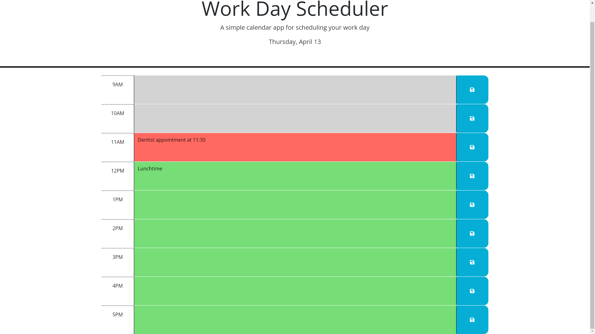

# Work-Day-Scheduler

## Description

This work day scheduler will help people schedule their days by hour. They will be able to save entries on the webpage as well as tell what day it is and what hour of the day it is by the interactive features on the page.

## Installation

N/A

## Usage

This webpage is rather straight forward. It works like a normal schedule that displays the data and the current business hours.  
To use this scheduler, all the user needs to do is click on one of the text areas and type in whatever they like.  
Then, after they have typed in something, they should click the blue save button that corresponds to the block of time that they want to save that information to.  
Finally, all they need to do is wait. When the time for the scheduled item comes up, it will change the highlight for that time from green to red, indicating that it is now the present. Below is a picture that displays concept this in action:  

## Credits

Big thanks to Brittani Court who helped me figure out how to save and get the local storage for the text areas!

## License

N/A